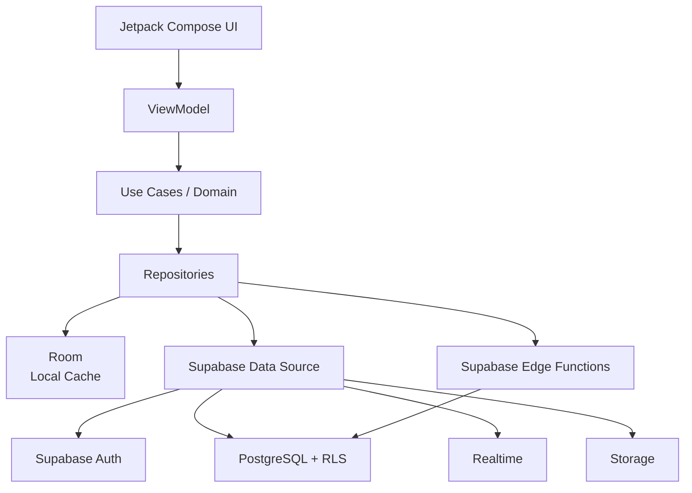
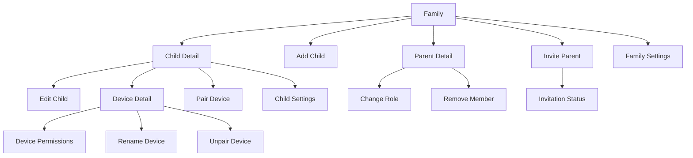
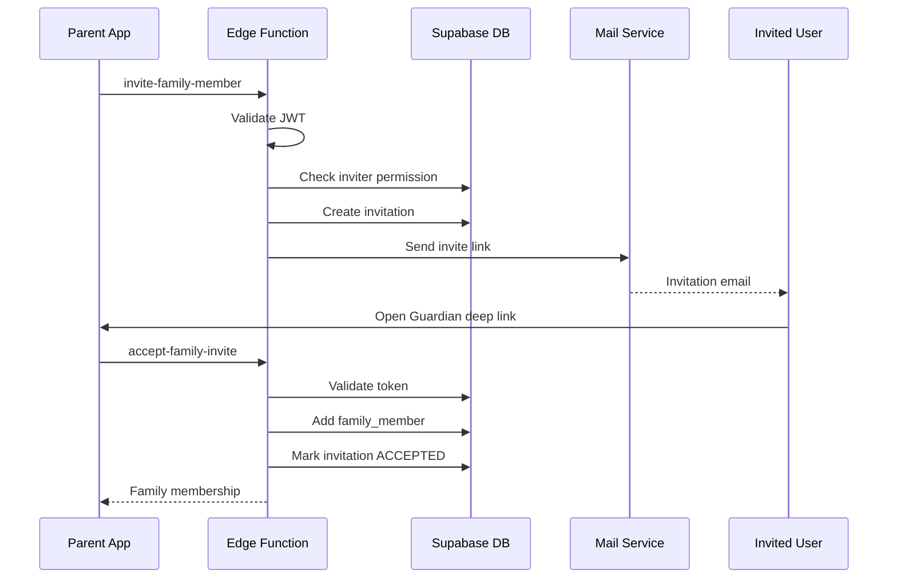
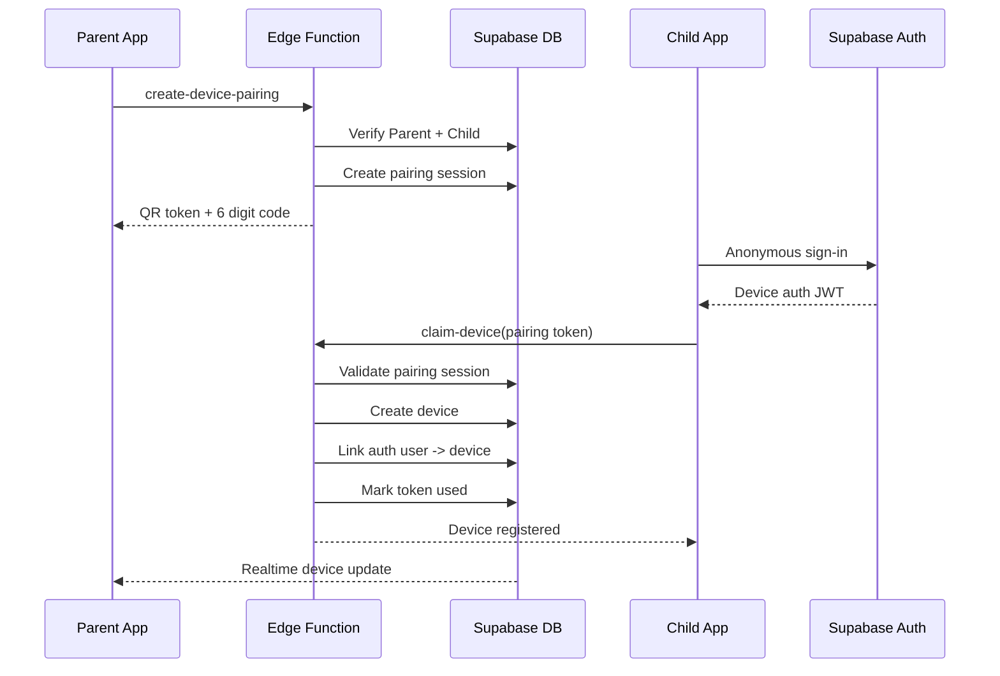
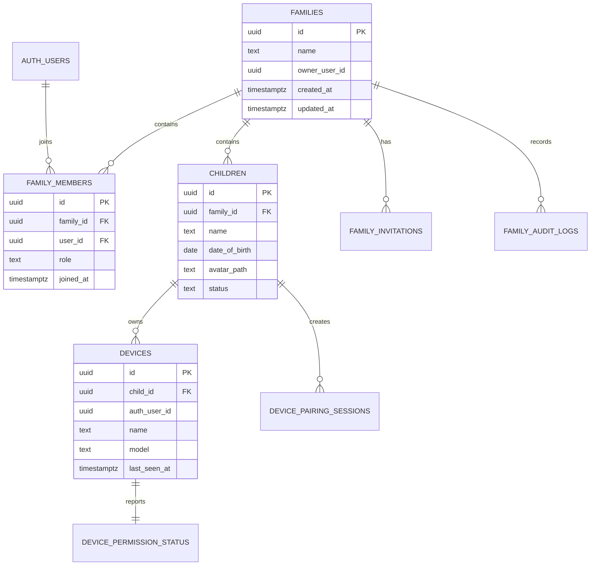
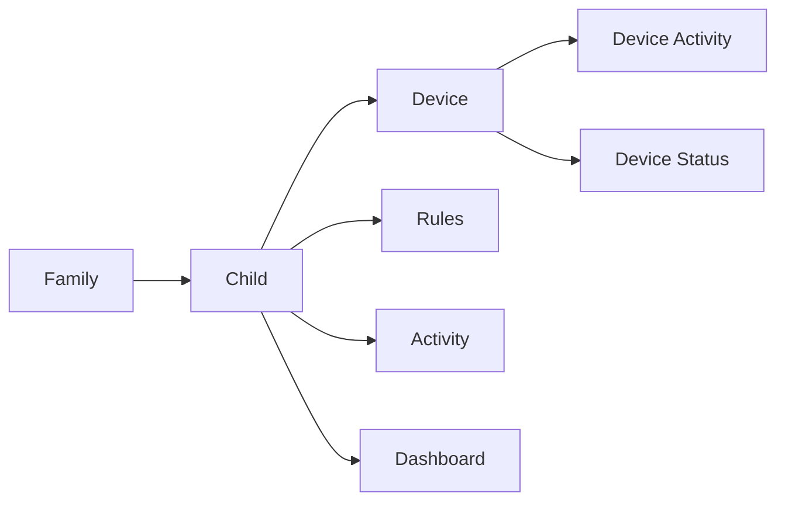

Được. Với **Guardian**, mình đề xuất bắt đầu tab **Family** như một module độc lập đủ hoàn chỉnh để sau này Dashboard / Rules / Activity chỉ cần tham chiếu `family_id`, `child_id`, `device_id`.

# Guardian — Family Module Specification v1.0

## 1. Phạm vi

Tab **Family** chịu trách nhiệm quản lý:

- Family/group.
- Child profile.
- Parent/Guardian members.
- Role và permission.
- Child devices.
- Pair/unpair device.
- Trạng thái Guardian trên device.
- Invitation.
- Các setting cấp Family/Child liên quan đến quyền quản lý.
- Audit các thao tác quan trọng.

Không đặt Screen Time, App Rules, Activity History trực tiếp trong module này. Family chỉ cung cấp entity `Child` và `Device` để các module đó sử dụng.

---

# 2. Kiến trúc tổng thể



Android nên theo kiến trúc UI → ViewModel → Domain/Data → Repository thay vì Composable gọi thẳng Supabase. Android hiện khuyến nghị Jetpack Compose, ViewModel, Unidirectional Data Flow, repository-based data layer và `Flow`/coroutines theo hướng này. :chatgpt-content-reference{index="0"}

---

# 3. Android Technology Stack

Đề xuất:

| Layer | Technology |
|---|---|
| Language | Kotlin |
| UI | Jetpack Compose |
| Design | Material 3 |
| Navigation | Navigation Compose / Navigation 3 |
| State | StateFlow |
| Lifecycle | `collectAsStateWithLifecycle()` |
| Dependency Injection | Hilt |
| Async | Kotlin Coroutines |
| Data stream | Flow |
| Local DB | Room |
| Preferences | DataStore |
| Backend | Supabase |
| Auth | Supabase Auth |
| Database | PostgreSQL |
| Realtime | Supabase Realtime |
| Backend logic | Edge Functions |
| Image/avatar | Supabase Storage |
| Serialization | kotlinx.serialization |
| Persistent sync | WorkManager |

Với tablet/foldable, màn Family rất phù hợp với **list-detail layout**: bên trái danh sách child/member, bên phải detail. Android hiện khuyến nghị adaptive layout thay vì khóa UI theo portrait/mobile; Material 3 Adaptive hỗ trợ trực tiếp list-detail pattern. :chatgpt-content-reference{index="1"}

Nếu sử dụng Supabase Kotlin SDK hiện tại, docs của Supabase ghi nhận `supabase-kt` hỗ trợ Auth, PostgREST, Realtime, Storage và Functions; SDK này hiện là community-maintained. Cấu hình Android mặc định yêu cầu minSdk 26 hoặc cần core library desugaring nếu thấp hơn. Với Guardian, mình sẽ chọn:

```text
minSdk = 26
```

để giảm complexity. :chatgpt-content-reference{index="2"}

---

# 4. Navigation của Family



Route naming:

```text
family

family/child/add
family/child/{childId}
family/child/{childId}/edit

family/child/{childId}/pair-device

family/device/{deviceId}
family/device/{deviceId}/permissions

family/member/{memberId}
family/invite

family/settings
```

Không truyền object lớn giữa navigation destinations.

Chỉ truyền ID:

```kotlin
ChildDetailRoute(childId)
```

ViewModel tự load entity từ repository.

---

# 5. Family Home

Đây là màn hình khi user bấm tab **Family**.

## UI

```text
Family
──────────────────────────

My Family
Nguyen Family
3 members · 2 children

Children
──────────────────────────
[Avatar] Nam
         10 years old
         Galaxy S25 · Online

[Avatar] Linh
         14 years old
         Pixel 10 · Offline

+ Add child


Parents & Guardians
──────────────────────────
[Avatar] You
         Owner

[Avatar] Lan Nguyen
         Parent

+ Invite parent


Family Settings                  >
```

Không nên show tất cả metadata kỹ thuật ngay Family Home.

Màn này phục vụ **overview + navigation**.

---

# 6. FamilyHome UI State

Không nên có nhiều boolean kiểu:

```kotlin
isLoading
isError
hasData
isRefreshing
```

nếu chúng có thể tạo state bất hợp lệ.

Đề xuất:

```kotlin
sealed interface FamilyUiState {

    data object Loading : FamilyUiState

    data class Content(
        val family: FamilyUiModel,
        val children: List<ChildUiModel>,
        val members: List<MemberUiModel>,
        val pendingInvitations: List<InvitationUiModel>,
        val isRefreshing: Boolean = false,
        val isOffline: Boolean = false
    ) : FamilyUiState

    data class Empty(
        val canCreateFamily: Boolean
    ) : FamilyUiState

    data class Error(
        val message: UiText
    ) : FamilyUiState
}
```

ViewModel:

```kotlin
class FamilyViewModel(
    private val observeFamily: ObserveFamilyUseCase,
    private val refreshFamily: RefreshFamilyUseCase
) : ViewModel() {

    val uiState: StateFlow<FamilyUiState>

    fun onAction(action: FamilyAction)
}
```

Actions:

```kotlin
sealed interface FamilyAction {
    data object Refresh : FamilyAction
    data object AddChild : FamilyAction
    data object InviteParent : FamilyAction

    data class OpenChild(
        val childId: UUID
    ) : FamilyAction

    data class OpenMember(
        val memberId: UUID
    ) : FamilyAction
}
```

Compose chỉ có nhiệm vụ:

```text
State -> render
User action -> ViewModel
```

đúng UDF. :chatgpt-content-reference{index="3"}

---

# 7. Create Family

Sau khi user đăng ký Guardian lần đầu và chưa thuộc Family nào:

```text
Welcome to Guardian

Create your family to start protecting
your children's devices.

Family name
[ Nguyen Family              ]

[ Create Family ]
```

### Input

`family_name`

Validation:

```text
required
trim
2–50 characters
```

Không cho UI tự set:

```text
owner_user_id
created_by
role
```

Backend xác định những field này từ authenticated JWT.

---

# 8. Add Child

Flow:

```text
Family
  ↓
Add Child
  ↓
Child information
  ↓
Create
  ↓
Child Detail
  ↓
Pair a device?
```

UI:

```text
Add child

        [ Add photo ]

Name *
[ Nam                       ]

Date of birth
[ 16 Sep 2016               ]

[ Create child ]
```

## Fields

| Field | Required | Rule |
|---|---|---|
| Name | Yes | 1–50 chars |
| Date of birth | No | <= current date |
| Avatar | No | image |
| Nickname | No | <= 30 |
| Gender | Không cần V1 | — |

Không cần lưu `age`.

Age phải tính từ:

```text
date_of_birth
```

tránh dữ liệu stale.

---

# 9. Child Detail

```text
← Nam                         ⋮

          [Avatar]
             Nam
          10 years old

Guardian
──────────────────────────

Galaxy S25
Online · 82%
Guardian active
Last seen just now            >

Tablet
Offline
Last seen yesterday           >

+ Add device


Protection
──────────────────────────

Rules
12 active rules               >

Activity
Last activity 4 min ago       >


Profile
──────────────────────────

Personal information          >
Child settings                >
```

Menu:

```text
Edit child
Archive child
Delete child
```

### Delete

Không delete ngay khi bấm.

```text
Delete Nam?

This removes Nam from your family and
disconnects all devices associated with
this child.

[Cancel] [Delete]
```

Nếu child có device:

```text
delete child
    ↓
revoke device association
    ↓
disable Guardian association
    ↓
archive dependent policy bindings
    ↓
soft delete child
```

Mình không khuyến nghị hard-delete ngay.

---

# 10. Child status

Không có status kiểu `ONLINE` được lưu cố định.

Device có:

```text
last_seen_at
```

Client derive:

```text
now - last_seen_at <= 2 minutes
    => ONLINE

2–15 minutes
    => RECENTLY_ONLINE

> 15 minutes
    => OFFLINE
```

Threshold nên nằm trong config/server constant để sau này điều chỉnh.

---

# 11. Parent / Guardian Management

Roles V1:

```text
OWNER
PARENT
VIEWER
```

Permission matrix:

| Operation | Owner | Parent | Viewer |
|---|:---:|:---:|:---:|
| View children | ✓ | ✓ | ✓ |
| View devices | ✓ | ✓ | ✓ |
| View activity | ✓ | ✓ | ✓ |
| Manage rules | ✓ | ✓ | ✗ |
| Add child | ✓ | ✓ | ✗ |
| Edit child | ✓ | ✓ | ✗ |
| Pair device | ✓ | ✓ | ✗ |
| Unpair device | ✓ | ✓ | ✗ |
| Invite parent | ✓ | ✓ | ✗ |
| Change roles | ✓ | ✗ | ✗ |
| Remove parent | ✓ | ✗ | ✗ |
| Delete family | ✓ | ✗ | ✗ |
| Transfer ownership | ✓ | ✗ | ✗ |

`OWNER` luôn chỉ có **1 user** ở V1.

Backend phải enforce chứ không chỉ disable button trên UI.

---

# 12. Invite Parent

UI:

```text
Invite to family

Email address
[ parent@example.com        ]

Role

(o) Parent
( ) Viewer

Parent
Can manage children, devices and rules.

Viewer
Can view family information and activity.

[ Send invitation ]
```

Sau khi gửi:

```text
Invitation sent

parent@example.com
Parent

Expires Sep 22, 2026

[ Resend ]
[ Cancel invitation ]
```

---

# 13. Invitation flow



Invite URL ví dụ:

```text
https://guardian.example.com/invite/{token}
```

Android App Link mở:

```text
Guardian
   ↓
Invitation screen
   ↓
Login / Sign up if necessary
   ↓
Accept
```

---

# 14. Invitation security

Database không lưu raw token:

```text
token_hash
```

Flow:

```text
random 256-bit token
        ↓
send raw token through invitation URL
        ↓
SHA-256
        ↓
store hash in database
```

Properties:

```text
single use
expires_at
accepted_at
cancelled_at
```

Recommended expiration:

```text
72 hours
```

Không cho:

```text
expired invitation
cancelled invitation
already used invitation
```

accept lại.

---

# 15. Pair Device

Đây là phần quan trọng nhất của Family.

Parent:

```text
Nam
  ↓
Add device
  ↓
QR / pairing code
```

Màn hình:

```text
Pair Nam's device

Open Guardian Child on Nam's device
and scan this QR code.

┌────────────────────┐
│                    │
│      QR CODE       │
│                    │
└────────────────────┘

Pairing code

       582 194

Expires in 09:42

[ Generate new code ]
```

Pairing code:

```text
6 digits
10-minute expiry
single use
```

QR không chỉ chứa `582194`.

QR nên chứa random high-entropy secret:

```json
{
  "version": 1,
  "pairingToken": "random-secure-token"
}
```

6-digit code chỉ dùng như phương án manual.

---

# 16. Device pairing backend flow



Supabase hỗ trợ anonymous authenticated users. Điểm rất quan trọng là anonymous users vẫn sử dụng PostgreSQL role `authenticated`; JWT có `is_anonymous` để phân biệt. Vì vậy Guardian phải có RLS riêng rất chặt cho child-device identities. :chatgpt-content-reference{index="4"}

---

# 17. Child Device Identity

Mỗi child device có:

```text
auth_user_id
```

được tạo bởi anonymous Supabase Auth.

Ví dụ:

```text
Auth User
uuid: c735...
is_anonymous: true

        │
        ▼

devices
id: d82...
auth_user_id: c735...
child_id: ...
```

Child device **không bao giờ** được quyền query:

```text
family_members
family_invitations
other children
other devices
parent profiles
```

Nó chỉ truy cập những resource được gán cho chính `device_id`.

---

# 18. Device Detail

```text
← Galaxy S25

Online

Guardian protection
● Active

Device
──────────────────────────
Model             Galaxy S25
Android           Android 16
Guardian          1.0.2
Battery           82%
Last seen         Just now

Permissions
──────────────────────────
Usage access      Granted
Accessibility     Granted
VPN               Active
Notifications     Granted
Location          Granted

                     View all >

Device management
──────────────────────────
Rename device                >
Unpair device                >
```

---

# 19. Device model

Server lưu metadata:

```text
id
family_id
child_id
auth_user_id

name

manufacturer
model
android_version
api_level

app_version
app_build

battery_level
charging

last_seen_at

protection_status
created_at
paired_at
unpaired_at
```

Không tin tưởng child device hoàn toàn cho dữ liệu authorization.

Ví dụ child device gửi:

```json
{
  "familyId": "abc",
  "childId": "xyz"
}
```

Backend **không** dùng chúng để quyết định nó thuộc family nào.

Backend lấy mapping từ:

```text
auth.uid()
   ↓
devices.auth_user_id
   ↓
device.child_id
   ↓
family_id
```

---

# 20. Device Permission Snapshot

Tạo table riêng:

```text
device_permission_status
```

Fields:

```text
device_id

usage_access
accessibility_service
notification_permission
vpn_active
location_permission
device_admin

updated_at
```

Không nhét tất cả vào `devices`.

Sau này có thể thêm:

```text
battery_optimization
overlay_permission
unknown_sources
exact_alarm
```

mà không phá cấu trúc Device.

---

# 21. Supabase Database Model

Core schema:



---

# 22. `families`

```sql
families
----------------------------
id                uuid PK
name              text
owner_user_id     uuid
created_at        timestamptz
updated_at        timestamptz
deleted_at        timestamptz nullable
```

Constraints:

```text
name not blank
owner_user_id required
```

Index:

```text
owner_user_id
```

---

# 23. `family_members`

```text
id              uuid PK
family_id       uuid FK
user_id         uuid FK -> auth.users
role            OWNER | PARENT | VIEWER
joined_at       timestamptz
created_at      timestamptz
```

Unique:

```text
UNIQUE(family_id, user_id)
```

Index:

```text
family_id
user_id
family_id + role
```

---

# 24. `children`

```text
id
family_id

name
nickname
date_of_birth
avatar_path

status
created_by
created_at
updated_at
archived_at
deleted_at
```

Status:

```text
ACTIVE
ARCHIVED
```

Không cần:

```text
age
online_status
device_count
```

vì đều là derived data.

---

# 25. `devices`

```text
id
family_id
child_id

auth_user_id

name

manufacturer
model
android_version
api_level

app_version
app_build

battery_level
charging

protection_status

last_seen_at
paired_at
unpaired_at

created_at
updated_at
```

`family_id` về lý thuyết derive được qua `child_id`.

Nhưng mình vẫn khuyến nghị lưu để:

```text
RLS đơn giản hơn
query nhanh hơn
Realtime filter dễ hơn
```

và enforce consistency bằng backend.

---

# 26. `family_invitations`

```text
id
family_id

email
role

token_hash

status
expires_at

invited_by
created_at

accepted_by
accepted_at

cancelled_at
```

Status:

```text
PENDING
ACCEPTED
EXPIRED
CANCELLED
```

Unique partial constraint nên chống việc gửi nhiều invitation `PENDING` cho cùng:

```text
family_id + lower(email)
```

---

# 27. `device_pairing_sessions`

```text
id
family_id
child_id

token_hash
manual_code_hash

created_by

expires_at
claimed_at
claimed_device_id
cancelled_at

created_at
```

Không lưu plaintext:

```text
pairing token
manual pairing code
```

---

# 28. `family_audit_logs`

Một parental-control app nên có audit history cho những thao tác quan trọng.

```text
id
family_id

actor_type
actor_id

action

entity_type
entity_id

metadata jsonb

created_at
```

Ví dụ:

```text
CHILD_CREATED
CHILD_UPDATED

DEVICE_PAIRED
DEVICE_UNPAIRED

MEMBER_INVITED
MEMBER_JOINED
MEMBER_REMOVED
MEMBER_ROLE_CHANGED

OWNERSHIP_TRANSFERRED
```

Audit log immutable.

Client:

```text
SELECT only
```

không:

```text
INSERT
UPDATE
DELETE
```

trực tiếp.

---

# 29. Supabase RLS

**Tất cả business tables phải bật RLS.**

Supabase Auth cung cấp JWT và tích hợp trực tiếp với PostgreSQL RLS; đây nên là authorization boundary thực sự, không dựa vào việc Android có hide button hay không. :chatgpt-content-reference{index="5"}

Ví dụ conceptual helper:

```sql
is_family_member(family_id)

has_family_role(
    family_id,
    roles[]
)
```

Parent read:

```text
SELECT children

ALLOW when:
auth.uid() belongs to family_members
for children.family_id
```

Write child:

```text
INSERT/UPDATE children

ALLOW:
OWNER
PARENT
```

Viewer:

```text
SELECT only
```

Owner operation:

```text
UPDATE roles
REMOVE member
DELETE family
TRANSFER ownership

ALLOW:
OWNER only
```

---

# 30. Phân biệt Parent Auth và Device Auth

Đây là rule cực kỳ quan trọng.

Parent JWT:

```text
is_anonymous = false
```

Device JWT:

```text
is_anonymous = true
```

Parent policy có thêm condition:

```sql
(auth.jwt()->>'is_anonymous')::boolean = false
```

Device policy:

```text
auth.uid() = devices.auth_user_id
```

Supabase lưu ý anonymous users vẫn sử dụng role `authenticated`, do đó nếu chỉ viết:

```sql
TO authenticated
```

thì **child device cũng có thể match policy**. Phải kiểm tra thêm `is_anonymous` hoặc mapping device. :chatgpt-content-reference{index="6"}

---

# 31. Direct DB vs Edge Function

Không cần bắt mọi thao tác đi qua Edge Function.

### Android → Supabase DB trực tiếp

Dùng cho:

```text
Get family
Get children
Get devices
Get members

Edit child basic information
Edit device name

Read permission status
```

RLS bảo vệ.

### Android → Edge Function

Dùng cho operation có side effects/security cao:

```text
create-family
invite-family-member
accept-family-invite
cancel-family-invite

change-member-role
remove-family-member
transfer-family-ownership

create-device-pairing
claim-device-pairing
unpair-device

delete-child
delete-family
```

Edge Functions chạy server-side và có thể kiểm tra JWT trước khi thực thi. Không đưa Supabase `service_role`/secret key vào Android app. :chatgpt-content-reference{index="7"}

---

# 32. API contract

Ví dụ:

### `create-device-pairing`

Request:

```json
{
  "childId": "0aceca16-..."
}
```

Response:

```json
{
  "pairingSessionId": "50cf...",
  "pairingToken": "bU0q....",
  "manualCode": "582194",
  "expiresAt": "2026-09-19T01:30:00Z"
}
```

---

### `claim-device-pairing`

```json
{
  "pairingToken": "bU0q....",
  "device": {
    "name": "Nam's Galaxy",
    "manufacturer": "Samsung",
    "model": "SM-S938B",
    "androidVersion": "16",
    "apiLevel": 36,
    "appVersion": "1.0.0",
    "appBuild": 100
  }
}
```

Response:

```json
{
  "deviceId": "09dd...",
  "childId": "5b1a...",
  "familyId": "03fc...",
  "pairedAt": "2026-09-19T01:21:45Z"
}
```

---

# 33. Standard error response

Tất cả Edge Function dùng cùng contract:

```json
{
  "error": {
    "code": "PAIRING_CODE_EXPIRED",
    "message": "The pairing code has expired.",
    "requestId": "ad810..."
  }
}
```

Error code không phụ thuộc text.

Ví dụ:

```text
FAMILY_NOT_FOUND
CHILD_NOT_FOUND
DEVICE_NOT_FOUND

FORBIDDEN
OWNER_REQUIRED

INVITATION_ALREADY_EXISTS
INVITATION_EXPIRED
INVITATION_ALREADY_USED

PAIRING_CODE_INVALID
PAIRING_CODE_EXPIRED
PAIRING_CODE_ALREADY_USED

DEVICE_ALREADY_PAIRED

LAST_OWNER_CANNOT_LEAVE
MEMBER_ALREADY_EXISTS
```

Android map:

```text
backend error
      ↓
domain error
      ↓
UiText
```

Không render raw backend exception cho user.

---

# 34. Realtime

Family nên subscribe Realtime cho:

```text
family_members
children
devices
device_permission_status
family_invitations
```

Ví dụ khi child device vừa pair:

```text
Child App
   ↓
DB devices INSERT
   ↓
Supabase Realtime
   ↓
Parent Android
   ↓
Family screen updates
```

Supabase Realtime có thể stream database changes thành Kotlin `Flow`; tuy nhiên Realtime replication cần được enable cho table cần theo dõi. :chatgpt-content-reference{index="8"}

Không subscribe toàn database.

Filter:

```text
family_id = currentFamilyId
```

---

# 35. Offline strategy

Family screen vẫn nên mở được khi mất Internet:

```text
Supabase
   ↓ sync
Room
   ↓ Flow
Repository
   ↓
ViewModel
   ↓
Compose
```

**Room là source of truth cho read UI.**

Khi mở Family:

```text
1. Load Room immediately
2. Render cached data
3. Refresh Supabase
4. Save into Room
5. Room emits new state
6. Compose updates
```

Đây cũng là hướng offline-first được Android khuyến nghị: local data source là source of truth cho phần dữ liệu cần offline; WorkManager phù hợp với persistent sync/retry work. :chatgpt-content-reference{index="9"}

---

# 36. Nhưng không queue mọi write offline

Không được offline queue các thao tác security-critical như:

```text
Delete family
Remove member
Transfer owner
Unpair device
Accept invite
Pair device
```

Khi offline:

```text
No internet connection.
Connect to the internet to perform this action.
```

Các operation này cần server confirmation ngay.

Có thể queue nhẹ:

```text
rename device
edit child nickname
```

nhưng V1 thậm chí có thể yêu cầu online cho tất cả writes để giảm conflict complexity.

---

# 37. Android package/module structure

Nếu project bắt đầu lớn:

```text
app/

core/
    model/
    database/
    network/
    designsystem/
    common/

feature/
    family/
        data/
        domain/
        ui/

    dashboard/
    rules/
    assistant/
    activity/
```

Trong `feature/family`:

```text
family/
├── data/
│   ├── local/
│   │   ├── FamilyDao
│   │   ├── ChildDao
│   │   └── DeviceDao
│   │
│   ├── remote/
│   │   ├── FamilyRemoteDataSource
│   │   ├── FamilyFunctionDataSource
│   │   └── FamilyRealtimeDataSource
│   │
│   ├── mapper/
│   └── repository/
│       └── FamilyRepositoryImpl
│
├── domain/
│   ├── model/
│   ├── repository/
│   │   └── FamilyRepository
│   └── usecase/
│
└── ui/
    ├── family/
    ├── child/
    ├── member/
    ├── device/
    └── pairing/
```

---

# 38. Repository interface

```kotlin
interface FamilyRepository {

    fun observeFamily(): Flow<Family>

    fun observeChildren(
        familyId: String
    ): Flow<List<Child>>

    fun observeMembers(
        familyId: String
    ): Flow<List<FamilyMember>>

    fun observeDevices(
        childId: String
    ): Flow<List<Device>>

    suspend fun refreshFamily()

    suspend fun createChild(
        request: CreateChildRequest
    ): Child

    suspend fun updateChild(
        childId: String,
        request: UpdateChildRequest
    )

    suspend fun createPairingSession(
        childId: String
    ): PairingSession

    suspend fun unpairDevice(
        deviceId: String
    )

    suspend fun inviteMember(
        email: String,
        role: FamilyRole
    )
}
```

ViewModel không biết:

```text
Supabase
PostgREST
Room
Edge Function
```

---

# 39. Family screen states

Mỗi screen phải support:

```text
Initial loading
Content
Empty
Refreshing
Offline cached
Recoverable error
Fatal error
Operation in progress
Operation success
Operation failed
```

Ví dụ Family Home offline:

```text
Family                       ⟳

You're offline
Showing information from 07:32

Children
...
```

Không thay toàn screen bằng:

```text
"No Internet"
```

nếu đã có cached data.

---

# 40. Loading standard

Initial:

```text
Skeleton
```

Refresh:

```text
pull-to-refresh indicator
```

Operation:

Ví dụ Invite:

```text
[ Sending... ]
```

chỉ disable action liên quan.

Không block toàn screen bằng full-screen spinner cho các mutation nhỏ.

---

# 41. Confirmation standard

Destructive action dùng Material AlertDialog.

Ví dụ:

```text
Unpair Galaxy S25?

Guardian will stop managing this device.
The child will need to pair the device again
to reconnect it.

Cancel             Unpair
```

Button destructive ở phía action cuối.

---

# 42. Accessibility

Mọi:

```text
avatar
icon
status indicator
button
```

phải có semantic/content description phù hợp.

Không biểu thị status chỉ bằng màu.

Sai:

```text
🟢
```

Đúng:

```text
● Online
```

Dynamic font size phải support.

Touch target theo Material/Android standard, tối thiểu khoảng:

```text
48dp
```

---

# 43. Avatar

Avatar storage:

```text
family-avatars/
    {familyId}/
        children/
            {childId}/avatar.webp
```

Không public bucket.

Access bằng authenticated request + Storage policy.

Upload flow:

```text
Android Photo Picker
      ↓
validate MIME
      ↓
resize
      ↓
compress WebP/JPEG
      ↓
upload Storage
      ↓
update child.avatar_path
```

Không lưu full public URL vào database.

Lưu:

```text
avatar_path
```

---

# 44. Audit requirements

Ví dụ Owner đổi Parent thành Viewer:

```text
family_audit_logs

actor_id:
    owner user id

action:
    MEMBER_ROLE_CHANGED

entity_id:
    member id

metadata:
{
   "oldRole": "PARENT",
   "newRole": "VIEWER"
}
```

Không log:

```text
JWT
pairing raw token
invitation raw token
password
```

---

# 45. Concurrency

Ví dụ Owner mở 2 devices và cùng edit Child.

Mỗi record nên có:

```text
updated_at
```

Update có thể gửi:

```text
expectedUpdatedAt
```

Backend có thể reject:

```text
409 CONFLICT
```

nếu record đã thay đổi.

UI:

```text
This information was changed on another device.

[Reload]
```

V1 có thể dùng last-write-wins cho name/avatar, nhưng **role/ownership/device pairing tuyệt đối không nên last-write-wins**.

---

# 46. Security invariants

Các invariant nên enforce ở PostgreSQL/backend:

```text
Family luôn có đúng một OWNER.

OWNER phải là member của family.

Child chỉ thuộc một family.

Device chỉ thuộc một child.

Device.family_id phải bằng Child.family_id.

Một auth device identity chỉ map tới một active device.

Pairing token chỉ sử dụng một lần.

Invitation token chỉ sử dụng một lần.

User không thể tự tăng role.

PARENT không thể đổi OWNER.

OWNER không thể tự remove nếu đang là OWNER cuối cùng.

Device không được query dữ liệu của parent.

User family A không được biết family B tồn tại.
```

Đây mới là nơi security thực sự được đảm bảo.

---

# 47. Family Home final UI hierarchy

Mình đề xuất V1 cuối cùng:

```text
Family
│
├── Family Header
│   ├── Family avatar
│   ├── Family name
│   └── Member count
│
├── Children
│   ├── Child Card
│   │   ├── Avatar
│   │   ├── Name
│   │   ├── Device summary
│   │   └── Protection status
│   │
│   └── Add child
│
├── Parents & Guardians
│   ├── Member
│   ├── Role
│   └── Pending invitation
│
├── Invite parent
│
└── Family Settings
```

**Không đưa Devices thành section ngang hàng Children ở Family Home.**

Relationship đúng là:

```text
Family
 ├── Parents
 │
 └── Children
      └── Devices
```

Điều này sẽ giúp các tab tiếp theo sạch hơn rất nhiều:



Sau khi Family hoàn thiện, toàn bộ hệ thống Guardian có thể chuẩn hóa context thành:

```text
currentFamilyId
currentChildId
selectedDeviceId?
```

và **Dashboard / Rules / Activity / Assistant đều sử dụng chung identity model này**, thay vì mỗi tab tự tạo khái niệm Child/Device riêng. Đây là nền tảng mình sẽ cố định trước khi phát triển 4 tab còn lại.